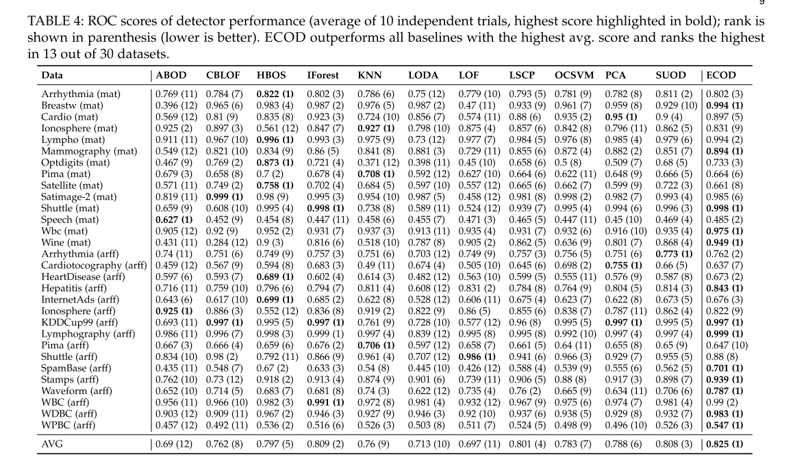
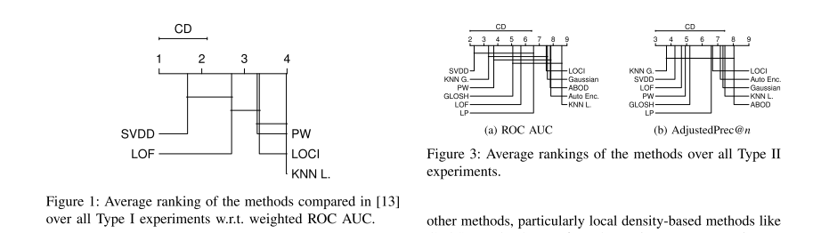
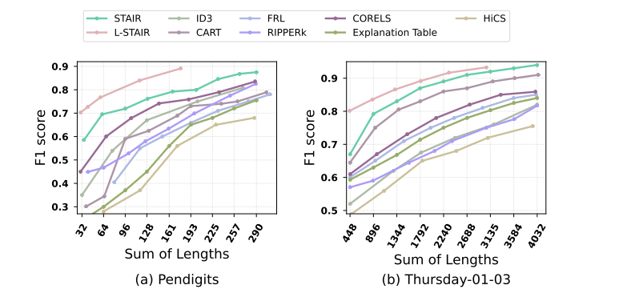
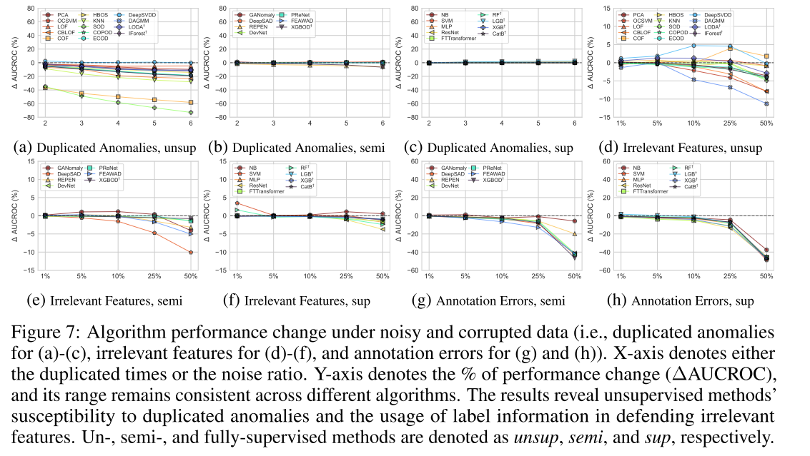
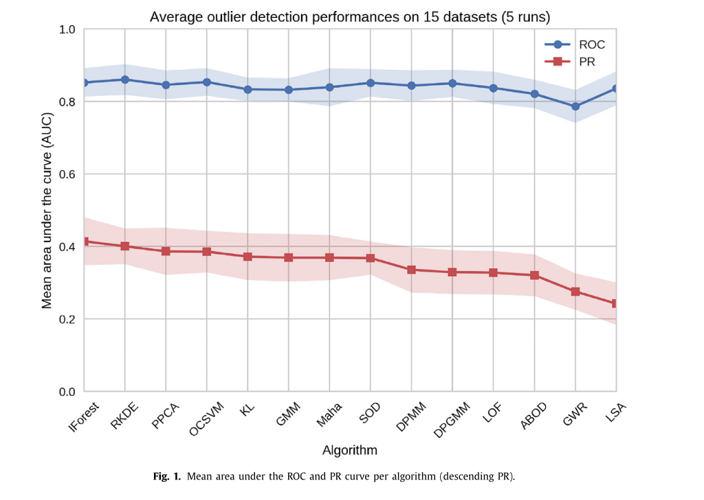

# 实验设置

选定的基准：


## 一、Rovas和基准对outliers的检测能力对比

### 1.1 实验设计内容一(对应实验三)

**Rovas以及其他基准在不同数据集中能发现多少比例的ugly outliers**

**1、所选数据集：**

```
file_path = "../datasets/real_outlier/Cardiotocography.csv"
file_path = "../datasets/real_outlier/annthyroid.csv"
file_path = "../datasets/real_outlier/optdigits.csv"
file_path = "../datasets/real_outlier/PageBlocks.csv"
file_path = "../datasets/real_outlier/pendigits.csv"
file_path = "../datasets/real_outlier/satellite.csv"
file_path = "../datasets/real_outlier/shuttle.csv"
file_path = "../datasets/real_outlier/yeast.csv"
```

**2、所选参与对比的基准（所有的易于执行的基准，可选择部分进行实验）**

```
监督深度（rovas下的基准）：
DevNet异常检测器
DeepSAD异常检测器
RoSAS异常检测器
PReNeT异常检测器

无监督深度（rovas下的基准）：
SLAD异常检测器
RCA异常检测器
NeuTraL异常检测器
GOAD异常检测器
DeepSVDD异常检测器
RePEN异常检测器
ICL异常检测器

无监督统计(pyod下的基准)：
ABOD异常检测器
COPOD异常检测器
ECOD异常检测器
IForest异常检测器
LODA异常检测器
LOF异常检测器

监督深度集成(adbench下的基准)：
CatBoost异常检测器
LGBoost异常检测器
XGBoost异常检测器

无监督生成式（adbench下的基准）
DAGMM异常检测器
```

**3、所选分类器（SVM分类器以及其余参与测试的分类器）**

```
SVM分类器
random forest分类器
softmax分类器
```

**4、实验指标**

```
暂定为ugly outliers的召回率
```

**5、最终呈现形式参考的图表（推荐使用大表）**





如果参考大表，可以选择上述两种大表形式中的一种，将上述表中的ROC AUC指标替换为recall，将数据集和基准替换为Rovas的数据集和基准




如果参考CD图，将上述CD图中的统计指标换为recall，确定使用哪一个具体的数据集


### 1.2 实验设计内容二(对应实验五)

**Rovas以及其他基准在不同异常类型（local/global/cluster/dependency）和异常比例(0/0.1/0.2/0.3)下的数据集中能发现多少比例的ugly outliers**

**1、所选数据集(结合实验五)**

```
Cardiotocography数据集+local噪声+不同噪声比例：
file_path = "../datasets/synthetic_outlier/Cardiotocography_local_0.1.csv"
file_path = "../datasets/synthetic_outlier/Cardiotocography_local_0.2.csv"
file_path = "../datasets/synthetic_outlier/Cardiotocography_local_0.3.csv"

PageBlocks数据集+global噪声+不同噪声比例:
file_path = "../datasets/synthetic_outlier/PageBlocks_global_0.1.csv"
file_path = "../datasets/synthetic_outlier/PageBlocks_global_0.2.csv"
file_path = "../datasets/synthetic_outlier/PageBlocks_global_0.3.csv"

Annthyroid数据集+cluster噪声+不同噪声比例：
file_path = "../datasets/synthetic_outlier/annthyroid_cluster_0.1.csv"
file_path = "../datasets/synthetic_outlier/annthyroid_cluster_0.2.csv"
file_path = "../datasets/synthetic_outlier/annthyroid_cluster_0.3.csv"

waveform数据集+dependency噪声+不同噪声比例
# file_path = "../datasets/synthetic_outlier/waveform_dependency_0.1.csv"
# file_path = "../datasets/synthetic_outlier/waveform_dependency_0.2.csv"
# file_path = "../datasets/synthetic_outlier/waveform_dependency_0.3.csv"
```

**2、所选基准**

```
监督深度（rovas下的基准）：
DevNet异常检测器
DeepSAD异常检测器
RoSAS异常检测器
PReNeT异常检测器

无监督深度（rovas下的基准）：
SLAD异常检测器
RCA异常检测器
NeuTraL异常检测器
GOAD异常检测器
DeepSVDD异常检测器
RePEN异常检测器
ICL异常检测器

无监督统计(pyod下的基准)：
ABOD异常检测器
COPOD异常检测器
ECOD异常检测器
IForest异常检测器
LODA异常检测器
LOF异常检测器

监督深度集成(adbench下的基准)：
CatBoost异常检测器
LGBoost异常检测器
XGBoost异常检测器

无监督生成式（adbench下的基准）
DAGMM异常检测器
```

**3、所选分类器**

```
SVM分类器
random forest分类器
softmax分类器
```

**4、实验指标**

```
暂定为ugly outliers的召回率
```

**5、最终呈现形式参考的图表（推荐使用小图）**



将数据集（如Pendigits）替换为数据集+异常类型（如Cardiotocography数据集+local噪声），横坐标为异常比例（0/0.1/0.2/0.3），纵坐标为ugly outliers的召回率，图例换为参与对比的基准和Rovas



或者参照上述ADBench中的图示进行测试


### 1.3 实验设计内容三（如果还有版面就做）(对应实验二)

**Rovas以及其他基准在不同数据集中能发现多少比例的outliers，对比Rovas和基准在传统异常检测领域（在正常值和异常值两种类型的分类数据中检测异常值的能力）的性能（如异常检测器的Accuracy）差异**

**1、所选数据集**

同上

**2、所选参与对比的基准**

同上

**3、所选分类器**

同上

**4、实验指标**

同上或添加其余评价指标（如Accuracy，Precision，AP，ROC AUC, PR AUC）

**5、最终呈现形式参考的图表（推荐使用小表）**

大表同实验设计1中的大表

如果使用小表，如果有多个实验指标，可以参考下面的图示：



将指标换为Rovas中的指标，选择2-3个数据集即可，横坐标为不同算法（含Rovas），纵坐标为指标


## 二、Rovas和基准对outliers修复后对下游分类任务影响的对比