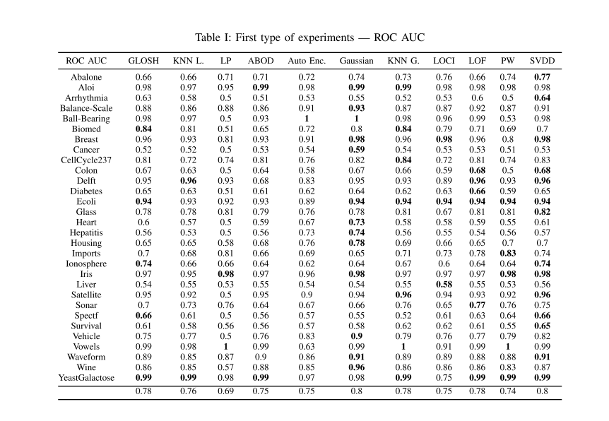
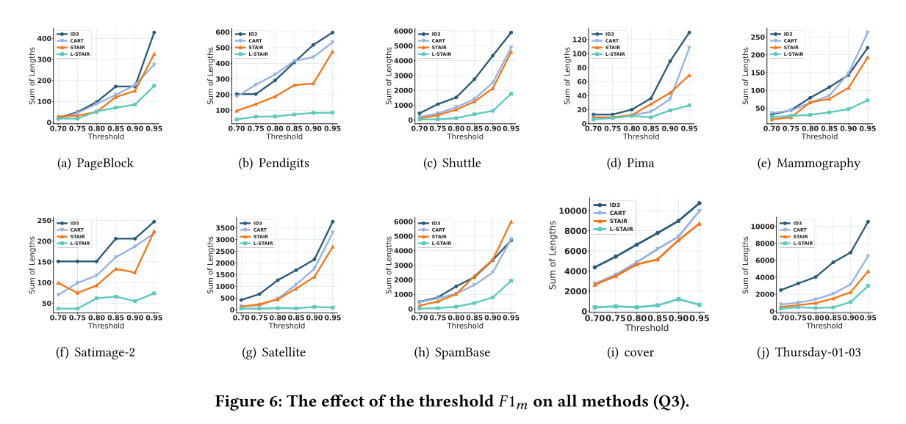
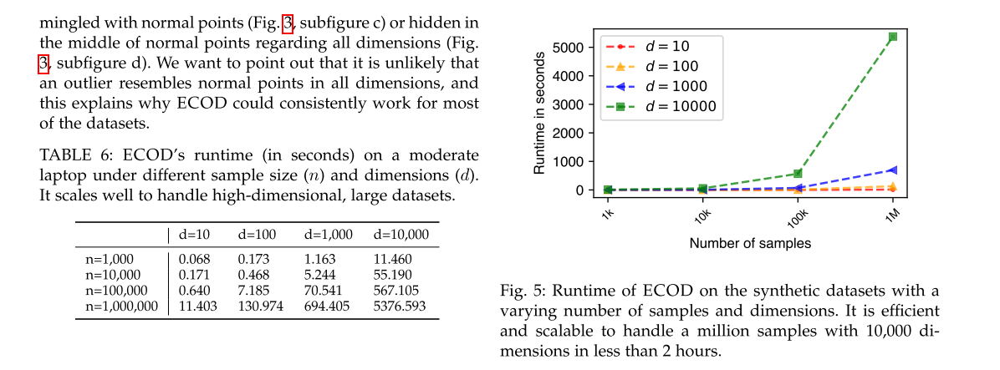

# 实验设置

选定的基准：


## 一、Rovas和基准对outliers的检测能力对比

### 1.1 实验设计内容一（对应实验一）

**Rovas以及其他基准在不同数据集中能发现多少比例的ugly outliers**

**1、所选数据集（可选择部分进行实验）**

```
file_path = "../datasets/real_outlier/Cardiotocography.csv"
file_path = "../datasets/real_outlier/annthyroid.csv"
file_path = "../datasets/real_outlier/optdigits.csv"
file_path = "../datasets/real_outlier/PageBlocks.csv"
file_path = "../datasets/real_outlier/pendigits.csv"
file_path = "../datasets/real_outlier/satellite.csv"
file_path = "../datasets/real_outlier/shuttle.csv"
file_path = "../datasets/real_outlier/yeast.csv"
```

**2、所选参与对比的基准（所有的易于执行的基准，可选择部分进行实验）**

```
监督深度（rovas下的基准）：
DevNet异常检测器
DeepSAD异常检测器
RoSAS异常检测器
PReNeT异常检测器

无监督深度（rovas下的基准）：
SLAD异常检测器
RCA异常检测器
NeuTraL异常检测器
GOAD异常检测器
DeepSVDD异常检测器
RePEN异常检测器
ICL异常检测器

无监督统计(pyod下的基准)：
ABOD异常检测器
COPOD异常检测器
ECOD异常检测器
IForest异常检测器
LODA异常检测器
LOF异常检测器

监督深度集成(adbench下的基准)：
CatBoost异常检测器
LGBoost异常检测器
XGBoost异常检测器

无监督生成式（adbench下的基准）
DAGMM异常检测器
```

**3、所选分类器（SVM分类器以及其余参与测试的分类器，可选择部分进行实验）**

```
SVM分类器
random forest分类器
softmax分类器
```

**4、实验指标**

```
暂定为ugly outliers的召回率
```

**5、最终呈现形式参考的图表（推荐使用大表）**




如果参考大表，可以选择上述两种大表形式中的一种，将上述表中的ROC AUC指标替换为recall，将数据集和基准替换为Rovas的数据集和基准


如果参考CD图，将上述CD图中的统计指标换为recall，确定使用哪一个具体的数据集


### 1.2 实验设计内容二（对应实验五）

**Rovas以及其他基准在不同异常类型（local/global/cluster/dependency）和异常比例(0/0.1/0.2/0.3)下的数据集中能发现多少比例的ugly outliers**

**1、所选数据集(结合实验五，可选择部分进行实验)**

```
Cardiotocography数据集+local噪声+不同噪声比例：
file_path = "../datasets/synthetic_outlier/Cardiotocography_local_0.1.csv"
file_path = "../datasets/synthetic_outlier/Cardiotocography_local_0.2.csv"
file_path = "../datasets/synthetic_outlier/Cardiotocography_local_0.3.csv"

PageBlocks数据集+global噪声+不同噪声比例:
file_path = "../datasets/synthetic_outlier/PageBlocks_global_0.1.csv"
file_path = "../datasets/synthetic_outlier/PageBlocks_global_0.2.csv"
file_path = "../datasets/synthetic_outlier/PageBlocks_global_0.3.csv"

Annthyroid数据集+cluster噪声+不同噪声比例：
file_path = "../datasets/synthetic_outlier/annthyroid_cluster_0.1.csv"
file_path = "../datasets/synthetic_outlier/annthyroid_cluster_0.2.csv"
file_path = "../datasets/synthetic_outlier/annthyroid_cluster_0.3.csv"

waveform数据集+dependency噪声+不同噪声比例
# file_path = "../datasets/synthetic_outlier/waveform_dependency_0.1.csv"
# file_path = "../datasets/synthetic_outlier/waveform_dependency_0.2.csv"
# file_path = "../datasets/synthetic_outlier/waveform_dependency_0.3.csv"
```

**2、所选基准（好用的基准，可选择部分进行实验）**

```
监督深度（rovas下的基准）：
DevNet异常检测器
DeepSAD异常检测器
RoSAS异常检测器
PReNeT异常检测器

无监督深度（rovas下的基准）：
SLAD异常检测器
RCA异常检测器
NeuTraL异常检测器
GOAD异常检测器
DeepSVDD异常检测器
RePEN异常检测器
ICL异常检测器

无监督统计(pyod下的基准)：
ABOD异常检测器
COPOD异常检测器
ECOD异常检测器
IForest异常检测器
LODA异常检测器
LOF异常检测器

监督深度集成(adbench下的基准)：
CatBoost异常检测器
LGBoost异常检测器
XGBoost异常检测器

无监督生成式（adbench下的基准）
DAGMM异常检测器
```

**3、所选分类器（可选择部分进行实验）**

```
SVM分类器
random forest分类器
softmax分类器
```

**4、实验指标**

```
暂定为ugly outliers的召回率
```

**5、最终呈现形式参考的图表（推荐使用小图）**


将数据集（如Pendigits）替换为数据集+异常类型（如Cardiotocography数据集+local噪声），横坐标为异常比例（0/0.1/0.2/0.3），纵坐标为ugly outliers的召回率，图例换为参与对比的基准和Rovas


或者参照上述ADBench中的图示进行测试


### 1.3 实验设计内容三（对应实验二，如果还有版面就做）

**对比Rovas和基准在传统异常检测领域（在正常值和异常值两种类型的分类数据中检测异常值的能力）的性能（如异常检测器的Accuracy）差异**

**1、所选数据集（可选择部分进行实验）**

同上

**2、所选参与对比的基准（好用的基准，可选择部分进行实验）**

同上

**3、所选分类器（可选择部分进行实验）**

同上

**4、实验指标**

同上或添加其余评价指标（如Accuracy，Precision，AP，ROC AUC, PR AUC）

**5、最终呈现形式参考的图表（推荐使用小图）**

大表同实验设计1中的大表

如果使用小表，如果有多个实验指标，可以参考下面的图示：


将指标换为Rovas中的指标，选择2-3个数据集即可，横坐标为不同算法（含Rovas），纵坐标为指标


## 二、Rovas和基准对outliers修复后对下游分类任务影响的对比

### 2.1 实验设计内容一（对应实验一）

**借助Rovas修复ugly outliers后，对下游分类器（如SVM分类器）的性能（如Accuracy）影响**

**1、所选数据集（实验四中的数据集，可选择部分进行实验）**

```
真实多分类数据集：
drybean数据集(效果好)
obesity数据集(效果好)
balita数据集(SVM拟合效果差，但修复后效果提升显著)
apple数据集(效果提升小)
adult数据集(效果提升明显)
body数据集(执行较慢，SVM拟合效果很差，但修复后效果有提升)
financial(SVM拟合效果很差，但修复后效果提升显著)
online(SVM拟合效果相对较差，但修复后效果提升显著)
star(SVM拟合相对准确，修复后效果提升显著)
student(SVM拟合相对较差，修复后效果提升显著)

真实异常检测数据集：
file_path = "../datasets/real_outlier/Cardiotocography.csv"
file_path = "../datasets/real_outlier/annthyroid.csv"
file_path = "../datasets/real_outlier/optdigits.csv"
file_path = "../datasets/real_outlier/PageBlocks.csv"
file_path = "../datasets/real_outlier/pendigits.csv"
file_path = "../datasets/real_outlier/satellite.csv"
file_path = "../datasets/real_outlier/shuttle.csv"
file_path = "../datasets/real_outlier/yeast.csv"
```

**2、所选基准（好用的基准，可选择部分进行实验）**

```
监督深度（rovas下的基准）：
DevNet异常检测器
DeepSAD异常检测器
RoSAS异常检测器
PReNeT异常检测器

无监督深度（rovas下的基准）：
SLAD异常检测器
RCA异常检测器
NeuTraL异常检测器
GOAD异常检测器
DeepSVDD异常检测器
RePEN异常检测器
ICL异常检测器

无监督统计(pyod下的基准)：
ABOD异常检测器
COPOD异常检测器
ECOD异常检测器
IForest异常检测器
LODA异常检测器
LOF异常检测器

监督深度集成(adbench下的基准)：
CatBoost异常检测器
LGBoost异常检测器
XGBoost异常检测器

无监督生成式（adbench下的基准）
DAGMM异常检测器
```

**3、所选分类器（结合实验一、四，可选择部分分类器进行实验）**

```
SVM分类器
random forest分类器
softmax分类器
decision tree 分类器
knn分类器
naivebayes分类器
```

**4、实验指标**

```
Accuracy(适用于类别分布均匀的情形)
F1-score/Precision/Recall(适用于类别分布不均)
ROC-AUC(适用于二分类)
PRAUC(适用于类别分布不均，用于平衡precision和recall)
AP(适用于类别分布不均，精确度和召回率的加权平均)
```

**5、最终呈现形式参考的图表（推荐使用大表）**


将大表中的数据集换成Rovas中使用的数据集，将基准换成Rovas中的基准，选择一个最适合比较的实验指标（如AP/ROC AUC/PR AUC），选择修复方案一或者方案五，统计修复前的实验指标和修复后的实验指标（比如第一行数据0.66为修复前的统计指标，在0.66后加入（↑0.22）就表示修复后准确度提升0.22，以此类推在一张表中同时体现修复前和修复后的分类器分类指标）


### 2.2 实验设计内容二（对应实验四）

**基于统计/直接删除/基于ML模型等不同修复方法下，修复ugly outliers的不同效果（体现在下游分类器的Accuracy等指标）**

**1、所选数据集（实验四中的数据集，可选择部分进行实验）**

同2.1实验设计内容一实验设计的数据集

**2、所选基准（好用的基准，可选择部分进行实验）**

不涉及基准

**3、所选分类器（结合实验一、四，可选择部分分类器进行实验）**

同2.1实验设计内容一实验设计的分类器

**4、实验指标**

同2.1实验设计内容一实验设计的实验指标

**5、最终呈现形式参考的图表（推荐使用小图）**

在Rovas内部进行不同修复方案的对比，不对比基准



采用折线图的形式参考上述图示画两个图：

第一个图如上图的图（a），将图（a）中的横坐标替换为多分类数据集，纵坐标替换为不同数据集上的修复效果提升，图中的折线为六种修复方案

第二个图如上图的图（a），将图（a）中的横坐标替换为真实异常检测数据集，纵坐标替换为不同数据集上的修复效果提升，图中的折线为六种修复方案


### 2.3 实验设计内容三（对应实验五）

**对比在不同异常比例下（合成数据集/真实数据集的不同异常比例），以及不同异常类型下（分别改变异常类型为local/global/Dependency/Cluster），Rovas修复性能对下游分类任务影响（如Accuracy）差异**

**1、所选数据集（实验五中的数据集，可选择部分进行实验）**

```
真实异常检测数据集：
Annthyroid数据集(效果稳定)
Cardiotocography数据集(效果稳定)
PageBlocks数据集(效果稳定)
Wilt数据集(效果稳定)

合成不同异常类型及异常比例的数据集：
Annthyroid数据集+cluster噪声+不同噪声比例(效果稳定)
Cardiotocography数据集+local噪声+不同噪声比例(好用)
PageBlocks数据集+global噪声+不同噪声比例(效果稳定)
satellite数据集+local噪声+不同噪声比例(好用)
annthyroid数据集+local噪声+不同噪声比例(好用)
waveform数据集+dependency噪声+不同噪声比例
```

**2、所选基准（好用的基准，可选择部分进行实验）**

不涉及基准

**3、所选分类器（结合实验一、四，可选择部分分类器进行实验）**

同2.1实验设计内容一实验设计的分类器

**4、实验指标**

同2.1实验设计内容一实验设计的实验指标

**5、最终呈现形式参考的图表（推荐使用小图）**


参照上述图表的形式，将小图中的数据集（如（a）PageBlock）替换为合成的异常类型（如local），横坐标为异常的比例，纵坐标为修复后下游分类任务的分类器性能提升（如Accuracy指标），图中的折线替换为不同数据集


## 三、Rovas可扩展性测试

### 2.1 实验设计内容一（对应实验六）

**随数据集的扩展（行，列，不同领域数据集，真实/合成数据集），资源消耗的变化（时间/内存占用等），在可扩展性测试中可重点关注两大类：1）Rovas部分谓词的可扩展性（我在代码中插入了对每个谓词分块的时间和内存监测）； 2）Rovas几种规则形式的可扩展性（可简单理解为整个代码执行下来的时间和内存监测）**。

**1、所选数据集（实验六中的数据集，可选择部分进行实验）**

```
真实多分类数据集：
drybean数据集(效果好)
obesity数据集(效果好)
balita数据集(SVM拟合效果差，但修复后效果提升显著)
apple数据集(效果提升小)
adult数据集(效果提升明显)
body数据集(执行较慢，SVM拟合效果很差，但修复后效果有提升)
financial(SVM拟合效果很差，但修复后效果提升显著)
online(SVM拟合效果相对较差，但修复后效果提升显著)
star(SVM拟合相对准确，修复后效果提升显著)
student(SVM拟合相对较差，修复后效果提升显著)

真实异常检测数据集：
file_path = "../datasets/real_outlier/Cardiotocography.csv"
file_path = "../datasets/real_outlier/annthyroid.csv"
file_path = "../datasets/real_outlier/optdigits.csv"
file_path = "../datasets/real_outlier/PageBlocks.csv"
file_path = "../datasets/real_outlier/pendigits.csv"
file_path = "../datasets/real_outlier/satellite.csv"
file_path = "../datasets/real_outlier/shuttle.csv"
file_path = "../datasets/real_outlier/yeast.csv"
```

**2、所选基准（好用的基准，可选择部分进行实验）**

不涉及基准

**3、所选分类器（结合实验一、四，可选择部分分类器进行实验）**

同2.1实验设计内容一实验设计的分类器

**4、实验指标**

时间消耗，内存占用

**5、最终呈现形式参考的图表（推荐使用小图或小表）**



对原始数据集进行行和列的随机采样（比例0.1/0.2/0.3/0.4/0.5/1），记录时间和内存占用的变化。或者可以自己合成数据集，可参考datasets_synthetic/generate_datasets.py下的合成方式。记录各个谓词以及整体的Rovas规则运行时间，以及内存消耗，随数据集行和列的扩展，具体的测试数据。